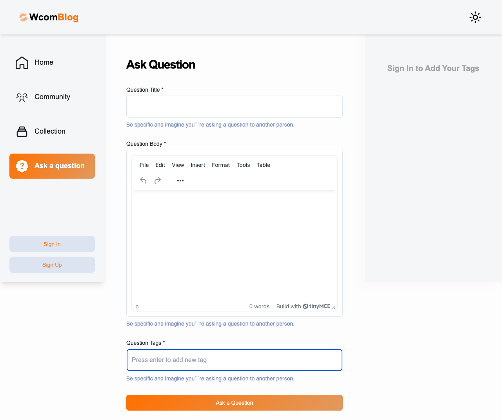
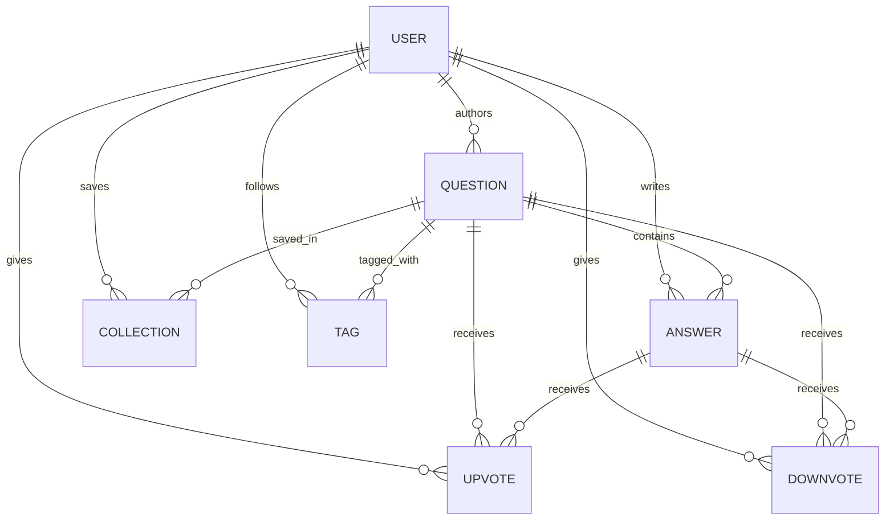

# StudyBlog — Developer Q&A Community Platform 🚀

[](https://nextjs.org/)
[](https://www.typescriptlang.org/)
[](https://tailwindcss.com/)
[](https://www.prisma.io/)
[](https://www.mysql.com/)
[](https://clerk.com/)
[](https://ai.google.dev/)

> **StudyBlog** is a full-stack, community-driven Q&A platform inspired by Stack Overflow. Designed for developers and learners, it features rich-text question and answer authoring, voting, custom tag curation, reputation gamification, and **StudyGuru** — an on-demand AI study assistant powered by **Google Gemini 2.5 Flash**.

---

## 📌 Table of Contents

- [Overview](#-overview)
- [Key Features](#-key-features)
- [Tech Stack](#-tech-stack)
- [Project Architecture](#-project-architecture)
- [Database Schema](#-database-schema)
- [Getting Started](#-getting-started)
  - [Prerequisites](#prerequisites)
  - [Installation](#installation)
  - [Environment Variables](#environment-variables)
  - [Database Migration](#database-migration)
  - [Running Locally](#running-locally)
- [Clerk Webhook Integration](#-clerk-webhook-integration)
- [AI Assistant: StudyGuru](#-ai-assistant-studyguru)
- [Available Scripts](#-available-scripts)
- [Contributing](#-contributing)
- [License](#-license)

---

## 🌟 Overview

StudyBlog empowers developers and students to collaborate, troubleshoot technical challenges, and build an open repository of programming solutions. Whether writing code explanations with syntax highlighting, bookmarking questions for revision, or asking Google Gemini 2.5 Flash for immediate architectural advice, StudyBlog delivers a modern developer experience.

<div align="center">
  
</div>

---

## ✨ Key Features

### 💬 Rich Q&A Community
- **Interactive Question Publishing**: Formulate questions using the **TinyMCE** rich-text editor with support for inline code snippets, formatted lists, and media.
- **Syntax Highlighting**: Answers and explanations are styled using **PrismJS** with themes that adapt to light and dark modes.
- **Tag-Based Organization**: Categorize questions with customizable tags to enable targeted discovery and community curation.
- **Question Editing & Management**: Authors can update question details, edit tags, or delete their posts.

### 🤖 Built-In AI Assistant: "StudyGuru"
- **Google Gemini 2.5 Flash Integration**: Built directly into the platform (`/ask-studyGuru`), users can prompt Gemini for explanations, debugging assistance, or concept summaries.
- **Markdown & Code Rendering**: Parses AI markdown responses into rich HTML and highlighted code blocks using `marked` and custom rendering components.

### 🗳️ Voting & Bookmark System
- **Upvote & Downvote**: Express feedback on questions and answers to highlight high-quality contributions.
- **Personal Collections (Bookmarks)**: Save important questions to personal collections with one click for easy access.

### 🏆 Gamification & Contributor Leaderboard
- **Reputation Points**: Users earn points for community participation (+5 points per question asked, +10 points per answer provided).
- **Contributor Profiles**: Display total reputation, badges, bio, portfolio links, and joined date.
- **Community Directory**: Discover peers, filter by "New Users", "Old Users", and "Top Contributors".

### 🎯 Personalized Feed & Followed Tags
- **Recommended Feed**: Smart filtering matches questions against user-followed tags in their sidebar.
- **Comprehensive Filters**: Filter questions and answers by *Newest*, *Recommended*, *Highest Upvotes*, and *Unanswered*.
- **Live Search & Pagination**: Client and server-side search by title or keywords, paired with custom pagination.

### 🌓 Modern Design & Accessibility
- **Dark & Light Mode**: Seamless theme switching with system preference detection powered by `next-themes`.
- **Accessible UI Components**: Built on top of **Radix UI** primitives with responsive Tailwind CSS layouts.
- **Interactive Feedback**: Real-time notifications and toasts with **Sonner**.

---

## 🛠️ Tech Stack

### Frontend
| Technology | Version | Purpose |
| :--- | :--- | :--- |
| **Next.js** | `14.2.5` | React framework (App Router, Server Components & Actions) |
| **React** | `18.x` | Core UI library |
| **TypeScript** | `5.x` | Type safety and developer experience |
| **Tailwind CSS** | `3.4.1` | Utility-first CSS styling and custom color tokens |
| **Radix UI** | Primitives | Accessible UI primitives (Dialog, Dropdown, Tabs, Menubar) |
| **Lucide React & React Icons** | Latest | Modern icons library |
| **TinyMCE React** | `5.1.1` | Rich WYSIWYG editor for asking and answering questions |
| **PrismJS** | `1.29.0` | Code syntax highlighting |
| **next-themes** | `0.3.0` | Dark and light theme orchestration |
| **Sonner** | `1.5.0` | Toast notifications |

### Backend & Database
| Technology | Version | Purpose |
| :--- | :--- | :--- |
| **Prisma ORM** | `6.18.0` | Next-generation Object-Relational Mapper |
| **MySQL** | `8.x` | Relational database engine |
| **Next.js Server Actions** | Native | Type-safe backend mutations (`actions/`) |
| **Next.js Route Handlers** | Native | API endpoints (`/api/gemini`, `/api/clerk`) |
| **Zod** | `3.23.8` | Schema validation and runtime data verification |
| **React Hook Form** | `7.52.1` | Form state management and validation |

### Authentication & Integrations
| Technology | Version | Purpose |
| :--- | :--- | :--- |
| **Clerk** | `@clerk/nextjs ^5.7.5` | User authentication, session management, and profile accounts |
| **Svix** | `1.81.0` | Cryptographic signature verification for Clerk webhooks |
| **Google Gemini API** | `gemini-2.5-flash` | Generative AI engine powering StudyGuru |

---

## 📂 Project Architecture

```plaintext
studyBlog/
├── actions/                  # Server Actions for DB mutations
│   ├── FetchAnswers.ts       # Retrieve and sort question answers
│   ├── FetchQuestion.ts      # Filter and sort questions (recommended/tags)
│   ├── FetchUser.ts          # Query and sort community members
│   ├── Question.ts           # Create, edit, and delete questions
│   ├── Tag.ts                # Manage tags and user follows
│   ├── answer.ts             # Submit and delete answers
│   ├── collection.ts         # Save/unsave questions to user collections
│   ├── downvote.ts           # Downvote logic for questions and answers
│   ├── upvote.ts             # Upvote logic for questions and answers
│   └── user.ts               # User creation, updates, and sync actions
├── app/                      # Next.js 14 App Router
│   ├── (auth)/               # Clerk authentication pages (sign-in, sign-up)
│   ├── (root)/               # Main application layout and routes
│   │   ├── (home)/           # Question feed with search & filters
│   │   ├── ask-studyGuru/    # Gemini 2.5 Flash AI Assistant page
│   │   ├── askQuestion/      # Create question page (TinyMCE)
│   │   ├── collection/       # Saved / Bookmarked questions
│   │   ├── community/        # Community members & contributor leaderboard
│   │   ├── profile/          # User profile and profile edit pages
│   │   └── question/         # Dynamic question details and edit pages
│   ├── api/                  # API Route Handlers
│   │   ├── clerk/            # Svix webhook endpoint for Clerk user synchronization
│   │   └── gemini/           # Server endpoint for Gemini 2.5 Flash queries
│   ├── globals.css           # Global Tailwind CSS and utility variables
│   └── layout.tsx            # Root layout with ClerkProvider & ThemeProvider
├── components/               # Reusable React components
│   ├── Theme/                # Dark/light theme provider and toggles
│   ├── ask/                  # AskEditQuestion, AskStudyGuru, TagInput
│   ├── global/               # QuestionCard, Votes, Filters, Pagination, ParseHTML
│   ├── navigation/           # Header, LeftSidebar, RightSidebar, AddTag
│   └── ui/                   # Shadcn/Radix UI primitive components
├── constants/                # Navigation links, filter options, default tags
├── lib/                      # Shared utilities, Prisma client instance, Zod schemas
│   ├── db.ts                 # Singleton Prisma client instance
│   ├── utils.ts              # Formatting, timestamp helpers, cn utility
│   └── validation.ts         # Zod schemas (Questions, Answers, Profile)
├── prisma/                   # Database schema and configuration
│   ├── schema.prisma         # Prisma data model definition
│   └── config.ts             # Prisma configuration
├── public/                   # Static assets, SVG icons, and illustrations
├── styles/                   # Prism code highlighting and theme CSS
├── middleware.ts             # Clerk authentication middleware matcher
├── next.config.mjs           # Next.js image domain configuration
├── tailwind.config.ts        # Custom Tailwind configuration and color palette
└── package.json              # Project dependencies and npm scripts
```

---

## 🗄️ Database Schema

The database is defined in [`prisma/schema.prisma`](file:///Users/mainak/Downloads/studyBlog-main/prisma/schema.prisma) using MySQL:



### Models Overview:
- **`user`**: Stores user identity, Clerk ID (`userId`), name, avatar, bio, portfolio URL, and reputation `points`.
- **`question`**: Stores question title, rich HTML content (`@db.LongText`), author reference, and timestamps.
- **`answer`**: Stores answer content (`@db.LongText`), associated question ID, and author ID.
- **`collection`**: Represents saved/bookmarked questions per user.
- **`upvote` & `downvote`**: Polymorphic vote tracking linked to either a question or an answer.
- **`tag`**: Dual-purpose tagging entity used for categorization on questions as well as user-followed interest tags.

---

## 🚀 Getting Started

### Prerequisites

Ensure you have the following installed on your machine:
- **Node.js**: `v18.17.0` or higher
- **npm** or **yarn** / **pnpm**
- **MySQL**: Local MySQL server (e.g. via Homebrew, Docker, XAMPP) or a cloud-hosted MySQL database (PlanetScale, Aiven, Railway, AWS RDS).

---

### Installation

1. **Clone the repository:**
   ```bash
   git clone https://github.com/your-username/studyBlog.git
   cd studyBlog
   ```

2. **Install project dependencies:**
   ```bash
   npm install
   ```
   *(Note: The `postinstall` script will automatically run `prisma generate`)*.

---

### Environment Variables

Create a `.env` file in the root directory by copying the provided [`.env.example`](file:///Users/mainak/Downloads/studyBlog-main/.env.example):

```bash
cp .env.example .env
```

Fill in the environment variables:

| Variable | Description | Where to Get |
| :--- | :--- | :--- |
| `DATABASE_URL` | MySQL connection string | Your local MySQL or cloud database provider |
| `NEXT_PUBLIC_CLERK_PUBLISHABLE_KEY` | Clerk Publishable Key | [Clerk Dashboard](https://dashboard.clerk.com/) |
| `CLERK_SECRET_KEY` | Clerk Secret Key | [Clerk Dashboard](https://dashboard.clerk.com/) |
| `NEXT_PUBLIC_CLERK_SIGN_IN_URL` | Relative path to sign-in page (`/sign-in`) | Pre-configured in `.env.example` |
| `NEXT_PUBLIC_CLERK_SIGN_UP_URL` | Relative path to sign-up page (`/sign-up`) | Pre-configured in `.env.example` |
| `NEXT_PUBLIC_CLERK_AFTER_SIGN_IN_URL`| Redirect after sign-in (`/`) | Pre-configured in `.env.example` |
| `NEXT_PUBLIC_CLERK_AFTER_SIGN_UP_URL`| Redirect after sign-up (`/`) | Pre-configured in `.env.example` |
| `WEBHOOK_SECRET` | Secret to verify Clerk Svix webhooks | Clerk Dashboard -> Webhooks -> Signing Secret |
| `GEMINI_API_KEY` | Google Gemini API key | [Google AI Studio](https://aistudio.google.com/) |
| `NEXT_PUBLIC_TINY_EDITOR_API_KEY` | TinyMCE Editor API key | [Tiny Cloud](https://www.tiny.cloud/) |

---

### Database Migration

Push the Prisma schema to your MySQL database:

```bash
# Push schema changes to MySQL
npx prisma db push

# (Optional) Open Prisma Studio to inspect your database visually
npx prisma studio
```

---

### Running Locally

Start the Next.js development server:

```bash
npm run dev
```

Open [http://localhost:3000](http://localhost:3000) in your browser.

---

## 🔔 Clerk Webhook Integration

StudyBlog automatically synchronizes user profiles with your database using Clerk Webhooks:

1. In your **Clerk Dashboard**, navigate to **Webhooks**.
2. Click **Add Endpoint** and set the endpoint URL to:
   - Development: `https://<your-tunnel-url>/api/clerk` (use ngrok, localtunnel, or the Clerk CLI)
   - Production: `https://your-domain.com/api/clerk`
3. Under **Message Filtering**, subscribe to:
   - `user.created`
   - `user.updated`
   - `user.deleted`
4. Copy the **Signing Secret** (`whsec_...`) and paste it as `WEBHOOK_SECRET` in your `.env` file.

---

## 🤖 AI Assistant: StudyGuru

StudyGuru provides direct in-app access to Google's **Gemini 2.5 Flash** model:
- **Route**: Accessible via the left navigation bar at `/ask-studyGuru`.
- **API Handler**: Handled securely on the server via `app/api/gemini/route.ts` using direct REST calls with parameter tuning (`temperature: 0.3`, `maxOutputTokens: 8000`).
- **Markdown & Code Formatting**: Responses are converted to styled HTML with Prism syntax highlighting and line breaks for code blocks.

---

## 📜 Available Scripts

| Command | Description |
| :--- | :--- |
| `npm run dev` | Starts the Next.js local development server with Turbopack |
| `npm run build` | Compiles the production build |
| `npm run start` | Runs the compiled production server |
| `npm run lint` | Runs ESLint to verify code quality and style rules |
| `npx prisma generate` | Generates the Prisma Client types based on `schema.prisma` |
| `npx prisma db push` | Pushes the current Prisma schema state to the connected database |
| `npx prisma studio` | Opens an interactive web interface for your database tables |

---

## 🤝 Contributing

Contributions, issues, and feature requests are welcome!

1. Fork the Project
2. Create your Feature Branch (`git checkout -b feature/AmazingFeature`)
3. Commit your Changes (`git commit -m 'Add some AmazingFeature'`)
4. Push to the Branch (`git push origin feature/AmazingFeature`)
5. Open a Pull Request
